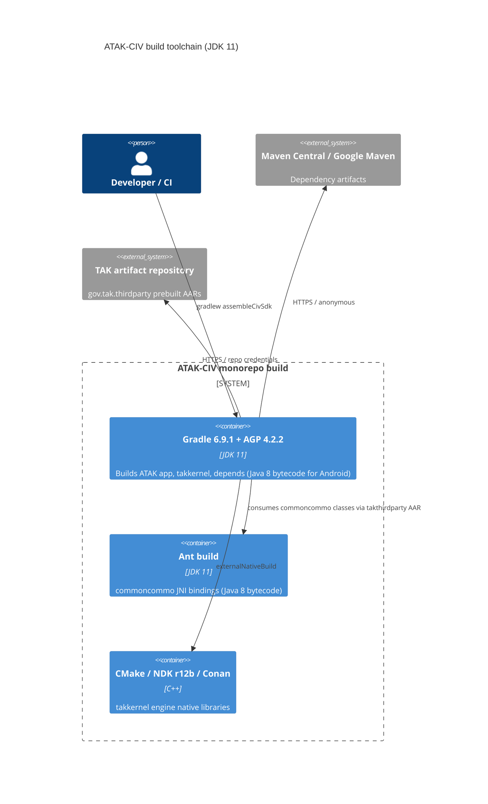

# 0001. Build toolchain upgrade from JDK 8 to JDK 11

- **Status:** Proposed
- **Date:** 2026-09-24
- **ARB ticket:** TO BE CREATED
- **Authors:** Devin (on behalf of the ATAK-CIV maintainers)
- **Owning team:** ATAK-CIV maintainers (TAK Product Center)
- **Related ADRs:** none (first ADR in this repository)

## Context

ATAK-CIV is a multi-module Android/native monorepo whose build declared a mixed set of Java
language levels (Java 1.6 in `commoncommo/jni/build.xml`, Java 1.7 in `depends/source/DataDroid`
and `depends/source/SimpleKML`, Java 1.8 in the ATAK app and `takkernel`) and whose CI ran inside
an `openjdk:8-jdk` container. JDK 8 is out of standard support for most distributions and the
`openjdk:8-jdk` Docker image is deprecated; the deprecated Android `sdk-tools` zip used by CI is no
longer maintained either.

The change moves the *build JDK* to 11 (CI container, `depends/source/Makefile` JDK check,
documentation), raises the `takkernel` Java (non-Android) kernel build to Java 11 source/target,
raises `commoncommo` from Java 1.6 to 1.8 (its classes ship inside the Android `takthirdparty`
AAR, so they must stay at Java 8 bytecode like the other Android modules), pins dynamic dependency versions, removes PowerMock in favour of
Mockito 4 `mockStatic`, and fixes JaCoCo so unit tests run on JDK 11.

Constraint: Android modules stay on Android Gradle Plugin 4.2.2 / Gradle 6.9.1 and Java 8
bytecode. Emitting Java 11 bytecode for Android requires AGP 7.0+ (javac rejects
`-bootclasspath android.jar` with `-target 11`), which in turn removes `android.enableR8=false`
that the SDK jar publishing (`minifyCivDebugWithProguard`) depends on. That larger migration is
deferred.

ARB triggers: T7 (runtime / toolchain major upgrade, JDK 8 -> 11 across all modules).
T3 heuristic hits (adoptium.net, dl.google.com URLs) are documentation/CI download hosts already
used by the project, and the only new package (`org.mockito:mockito-inline`, test scope) does no
network I/O — treated as false positives.

## Decision

We will build every module of the repository with JDK 11 (CI container `eclipse-temurin:11-jdk-jammy`),
set Java 11 source/target for the non-Android `takkernel` build, keep Android modules and
Android-consumed code (`commoncommo`) on Java 8 bytecode with AGP 4.2.2, pin all dynamic dependency versions, and replace PowerMock with Mockito 4
static mocking.

## Alternatives considered

| Alternative | Pros | Cons | Why rejected |
| --- | --- | --- | --- |
| Do nothing | No change risk | Stays on deprecated JDK 8 image and deprecated Android sdk-tools; PowerMock 2.0.2 is unmaintained | Toolchain rot; blocks future Android/AGP upgrades |
| Upgrade to AGP 7.x / Gradle 7 and Java 11 bytecode for Android too | Full Java 11 language support on Android | Removes `android.enableR8=false`; SDK jar/mapping artifacts must be re-implemented on the ProGuard Gradle plugin or R8; larger blast radius | Out of scope for a toolchain bump; tracked as follow-up |
| Build with JDK 17 instead of 11 | Longer support horizon | AGP 4.2.2 does not support JDK 17 (requires AGP 7.x); Gradle 6.9.1 cannot run on 17 | Not possible without the AGP 7 migration above |

## Architecture

## Non-functional requirements

| NFR | Target | How met |
| --- | --- | --- |
| Availability SLO | N/A — build toolchain, no runtime service | |
| p95 latency | N/A — build toolchain | |
| RPO / RTO | N/A — no data | |
| Peak load | N/A | |
| Scaling model | N/A | |
| Data retention | N/A | |

## Security & compliance

- **Data classification:** none — no application data touched; build configuration only.
- **Encryption at rest:** N/A.
- **Encryption in transit:** dependency downloads over HTTPS (unchanged hosts).
- **AuthN / AuthZ:** unchanged; TAK artifact repository credentials remain in Gradle properties/CI secrets.
- **Secrets:** no new secrets.
- **Audit logging:** N/A.
- **Data residency / regions:** N/A.
- **Policy sections satisfied:** no infrastructure resources created or changed.
- **Threats considered:** supply chain — all new/changed dependency versions (Mockito 4.11.0,
  mockito-inline 4.11.0, JaCoCo 0.8.7, takdev 2.4.1) are pinned, long-published releases; the
  `eclipse-temurin:11-jdk-jammy` image is the vendor-supported successor to the deprecated `openjdk:8-jdk`.

## Cost

| Item | Assumption | Monthly estimate |
| --- | --- | --- |
| CI compute | Same GitHub Actions workflows, same job shape | $0 incremental |
| **Total** | | $0 |

## Operations

- **On-call rotation:** N/A — build toolchain.
- **Runbook:** `BUILDING.md`, `atak/README.md`, `takkernel/README.md` (updated to JDK 11).
- **Dashboards / alarms:** GitHub Actions workflow status (`assemble-sdk`, `release-sdk`).
- **Rollback plan:** revert the PR; no data migration involved.
- **Migration / cut-over plan:** developers install a JDK 11 and point `JAVA_HOME` at it; the
  `depends/source/Makefile` guard now rejects non-11 JDKs with an explicit message.

## Policy exceptions requested

| Rule | Resource | Justification | Compensating control | Expiry |
| --- | --- | --- | --- | --- |
| none | | | | |

## Consequences

- Positive: supported JDK and CI image; reproducible dependency versions; PowerMock removed;
  JDK 11 unit tests run (JaCoCo no longer instruments `jdk.internal.*`).
- Negative / risks: Android modules still emit Java 8 bytecode, so Java 11 language features
  cannot be used in Android sources yet; the deprecated `android.enableR8=false` flag remains.
- Follow-ups: AGP 7.x / Gradle 7 migration with ProGuard Gradle plugin or R8 for the SDK jar,
  enabling Java 11 bytecode for Android modules.

## Open questions

- Whether the ARB wants the AGP 7 migration scheduled as a follow-up ADR or folded into this one.
